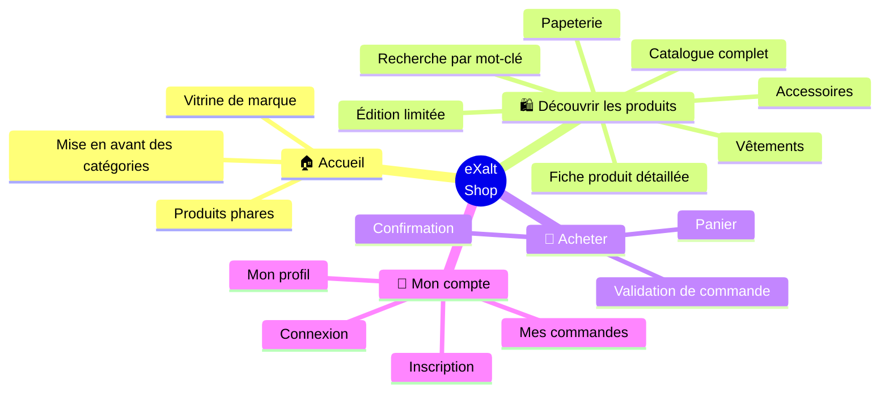
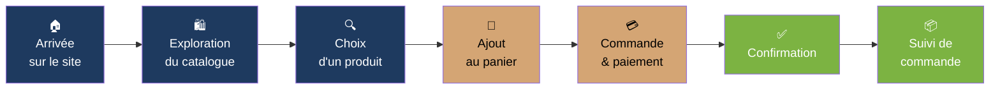

# 🗺️ eXalt Shop — Cartographie du site

> Vue d'ensemble pour présentation comité de direction

---

## 🎯 Le site en un coup d'œil

---

## 🚶 Le parcours d'un client

---

## 📑 Les pages du site, regroupées par usage

| Univers | Pages | À quoi ça sert |
|---|---|---|
| 🏠 **Vitrine** | Accueil | Première impression, mise en scène de la marque |
| 🛍️ **Catalogue** | Boutique · Catégories · Recherche · Fiche produit | Aider le client à trouver et choisir |
| 🛒 **Achat** | Panier · Commande · Confirmation | Concrétiser la vente |
| 👤 **Espace client** | Inscription · Connexion · Profil · Historique commandes | Fidéliser et créer une relation durable |

---

## 📊 En chiffres

| Indicateur | Valeur |
|---|---|
| Pages totales | **13** |
| Catégories produits | **4** |
| Étapes du parcours d'achat | **4** (catalogue → panier → commande → confirmation) |
| Pages d'espace client | **4** |

---

## ⚠️ Pages absentes (à considérer)

- ❌ Page d'erreur **404** (utilisateur perdu = utilisateur qui part)
- ❌ **CGV / Mentions légales** (obligation légale en France)
- ❌ **FAQ / Aide / Contact**
- ❌ **Politique de retour & SAV**
- ❌ **Page "À propos"** / story de la marque
